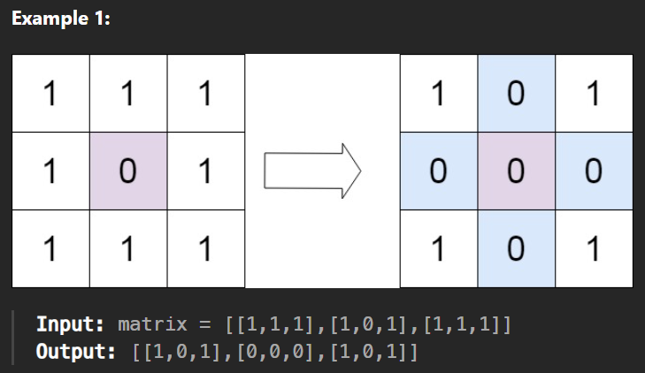
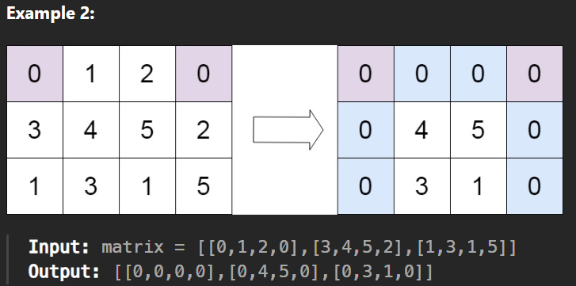

# Set Matrix Zeroes

Given an `m x n` integer matrix matrix, if an element is 0, set its entire row and column to 0's.

You must do it in place.

## Constraints:

`m == matrix.length`
`n == matrix[0].length`
`1 <= m, n <= 200`
`-231 <= matrix[i][j] <= 231 - 1`

## Follow up:

- A straightforward solution using O(mn) space is probably a bad idea.
- A simple improvement uses O(m + n) space, but still not the best solution.
- Could you devise a constant space solution?

## Source

[73. Set Matrix Zeroes](https://leetcode.com/problems/set-matrix-zeroes/)
