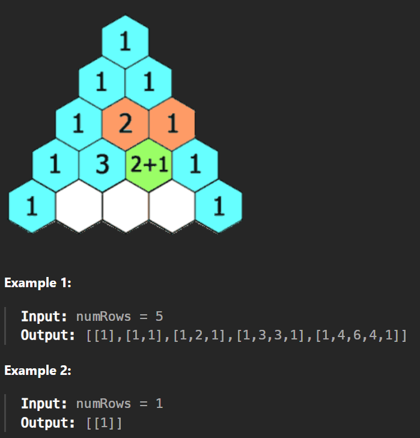

# Pascal's triangle

# 1. Return the first nth rows of Pascal's triangle

Given an integer numRows, return the first numRows of Pascal's triangle.

In Pascal's triangle, each number is the sum of the two numbers directly above it as shown:

## Constraints:

* `1 <= numRows <= 30`

## Source

[118. Pascal's triangle I](https://leetcode.com/problems/pascals-triangle/)

# 2. Find the element at the nth row and nth column of Pascal's triangle.

# 3. Print nth row of Pascal's triangle.
[119. Pascal's triangle II](https://leetcode.com/problems/pascals-triangle-ii/)