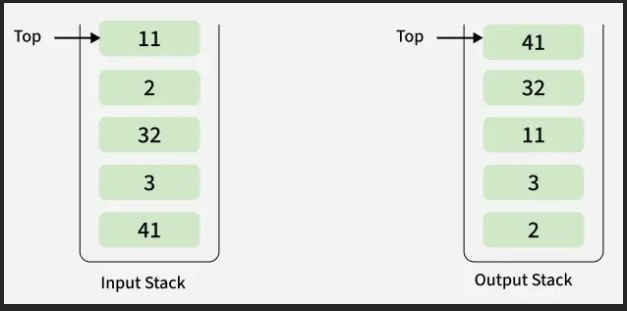

# Chain of thought

# Sort a Stack

Input: st[] = [41, 3, 32, 2, 11]
Output: [41, 32, 11, 3, 2]



Explanation: After sorting, the smallest element (2) is at the bottom and the largest element (41) is at the top.

# Solution

Using Priority Queue

time : O(n log n) space : O(n)

```java
class Solution {
    public void sortStack(Stack<Integer> st) {
        // code here
        PriorityQueue<Integer> minHeap = new PriorityQueue<>();

        while(!st.isEmpty()) minHeap.offer(st.pop());


        while(!minHeap.isEmpty()) st.push(minHeap.poll());
    }
}
```

Using Recursion

time : O(n^2) space : O(n)

```java
class Solution {
      public static void sort(Stack<Integer> stack) {
        // Base case
        if (stack.isEmpty()) {
            return;
        }

        // Remove top element
        int top = stack.pop();

        // Sort remaining stack
        sort(stack);

        // Insert the removed element at its correct position
        insert(stack, top);
    }

    private static void insert(Stack<Integer> stack, int value) {
        // Base case
        if (stack.isEmpty() || stack.peek() <= value) {
            stack.push(value);
            return;
        }

        // Remove top element
        int top = stack.pop();

        // Recur
        insert(stack, value);

        // Put back the removed element
        stack.push(top);
    }

}
```
